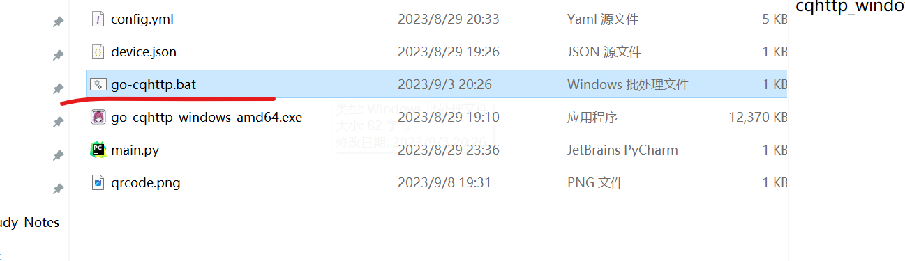
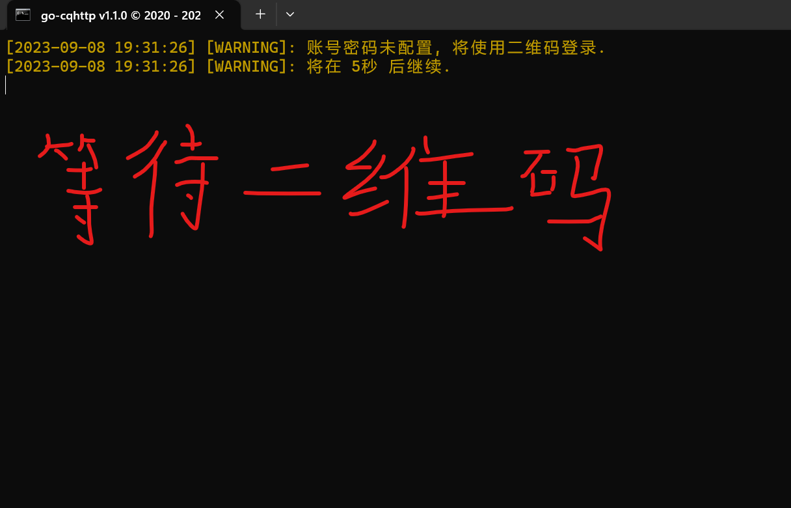
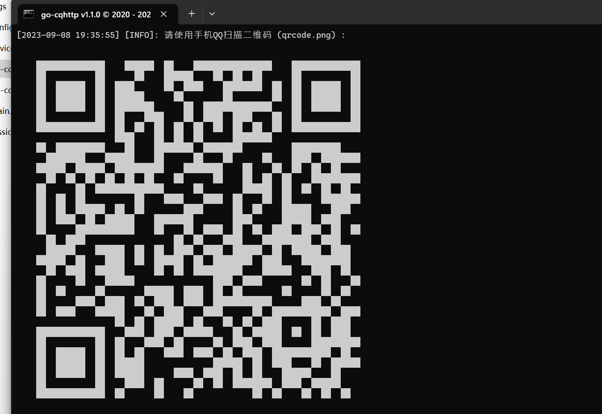
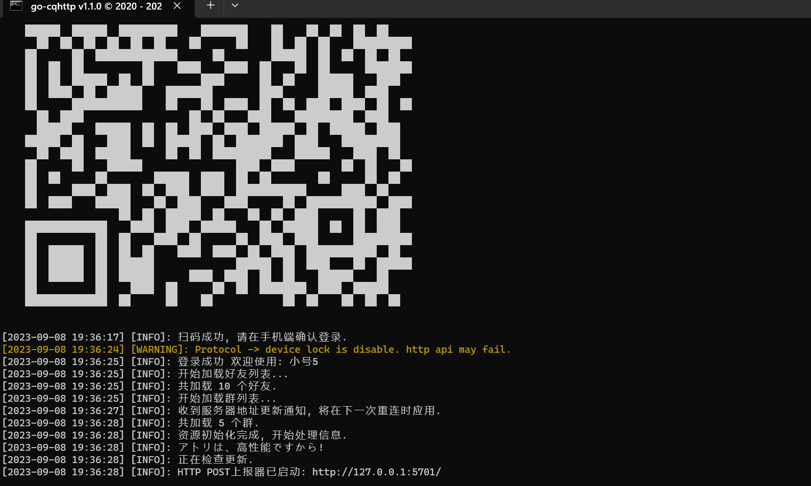
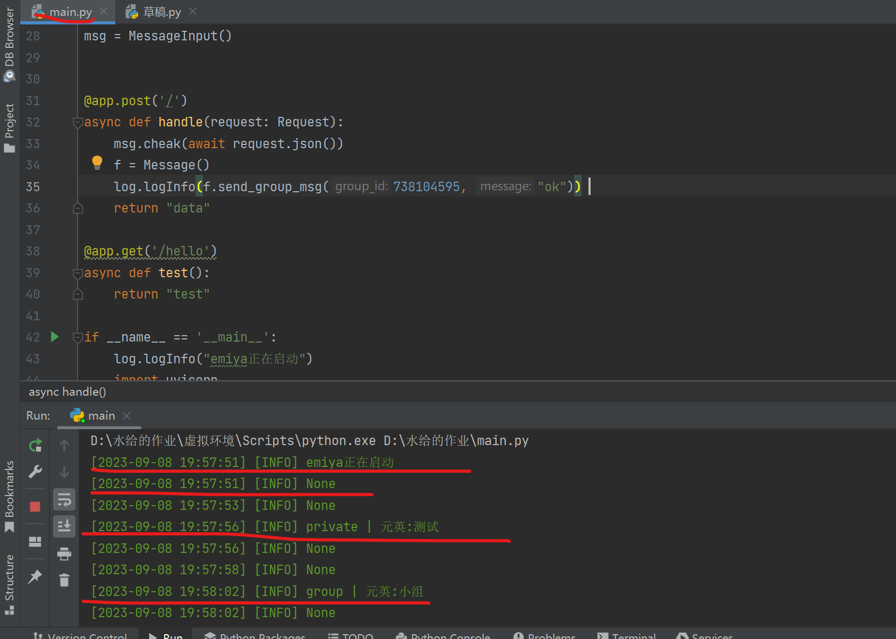

# 开始使用

## 1. 确认Python版本

```shell
python --version
```

- 确保版本在3.8+

## 2. 下载emiya

- 选择一个合适的框架代码存放位置
- 以下指令二选一

```shell
git clone git@github.com:Lixeer/emiya.git
```

```shell
git clone https://github.com/Lixeer/emiya.git
```

- [查看github仓库](https://github.com/Lixeer/emiya)


## 3. 安装必要的库

- 进入emiya目录，使用以下命令

```shell
pip install -r requirement.txt
```

## 4. 启动emiya

- 启动emiya框架目录下的main.py文件

## 5. 启动go-cqhttp

- 切换到emiya框架目录
- 启动go-cqhttp.bat文件


- 等待需要扫码登录的二维码（注意，默认大小的窗口里，二维码可能显示不全，‘’Ctrl‘’ + ‘’-’’  将字体缩小即可）。



- 二维码显示出来后，使用需要用作机器人的QQ进行扫码登录（注意：二维码在2分钟后就会过期，此时就得重新运行文件等待二维码）
- 扫码成功后需要确认登录，登陆成功后如图


